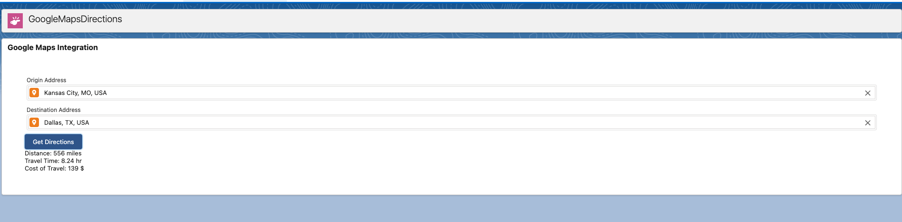

# Google-Maps-integration!

## File structure
-- 
About

This is a generic & customizable lookup component that shows the Distance, Travel Time, and cost of Travel built using Salesforce Lightning Web Components and SLDS style.
It does not rely on third party libraries and you have full control over its datasource.

Features

The lookup component provides the following features:

Requirements:
 * Display a webpage that allows the user to enter an origin address and a destination address. The
    LWC should use the Google Maps API to autocomplete the addresses as the user types.
 * When the user clicks the "Get Directions" button, the webpage calls an Apex class using
    JavaScript to pass the address information.
 * The Apex class should use the Google Maps API to calculate the distance and travel time
    between the origin and destination addresses.
 * The Apex class should also calculate the cost of travel, based on a fixed rate per mile for
    different modes of transportation (i.e: flying, driving). The rates should be stored in a Custom
    Metadata Type.
 * The Apex class should pass the distance, travel time, and cost of travel back to the LWC.
 * The LWC should display the distance, travel time, and cost of travel to the user.
 * Important! The Apex class should include a variable called `vHash` where your full name is
    assigned in Base64 encoding. Your name should not appear in plaintext. Example (John Doe):
    “String vHash = ‘Sm9obiBEb2U=’;”.
 * Include passing unit tests with Http Mock.

## Demo

===================

===================

  Custom Metadata Type:
  
  ===============
  
  
  

